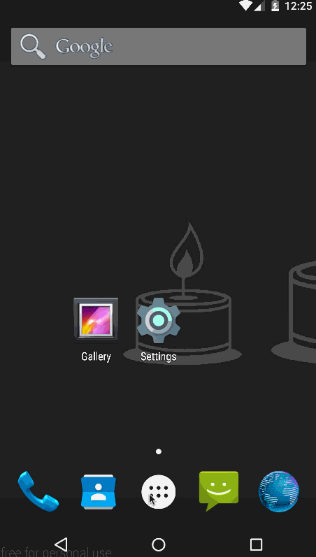

# Pre-work - *MyToDo*

**MyToDo** is an android app that allows building a todo list and basic todo items management functionality including adding new items, editing and deleting an existing item.

Submitted by: **Dianne Bautista**

Time spent: **12** hours spent in total

## User Stories

The following **required** functionality is completed:

* [x] User can **successfully add and remove items** from the todo list
* [x] User can **tap a todo item in the list and bring up an edit screen for the todo item** and then have any changes to the text reflected in the todo list.
* [x] User can **persist todo items** and retrieve them properly on app restart

The following **optional** features are implemented:

* [x] Persist the todo items [into SQLite](http://guides.codepath.com/android/Persisting-Data-to-the-Device#sqlite) instead of a text file
* [x] Improve style of the todo items in the list [using a custom adapter](http://guides.codepath.com/android/Using-an-ArrayAdapter-with-ListView)
* [x] Add support for completion due dates for todo items (and display within listview item)
* [x] Add support for selecting the priority of each todo item (and display in listview item)
* [x] Tweak the style improving the UI / UX, play with colors, images or backgrounds

The following **additional** features are implemented:

* [x] Add a `splash_screen` that fetches the list of items from the database before the `TodoListActivity` is loaded
* [x] Add support for showing a "check mark" when a todo item is marked as "Done"
* [x] Wrap the `DatePickerDialog` and `AlertDialog` in a `DialogFragment` to make them more re-usable

## Video Walkthrough 

Here's a walkthrough of implemented user stories:

## Implementation Notes
* I didn't use a DialogFragment (instead of new Activity) for editing items. I created an activity called `TodoInputActivity` which was used for both adding a new item or editing a new item. The only difference is that the user input is populated when an item is being edited.
* I didn't pass the `TodoItem` as an `extra` when switching from one activity to another. Instead, this is stored in the `TodoManager`, which maintains the selected item and manages the persistent state of the item.

## Notes
Describe any challenges encountered while building the app.
* Inconsistent behavior on different devices
  * Before using a `DatePicker` in the `DateChooserDialogFragment`, I was using a `CalendarView`. This works well on my Samsung Galaxy S6, but the app hangs when using Samsung Galaxy S3 and when the dialog finally shows up, the view looks compressed. As it turns out, I have to set the `layout_width` and `layout_height` to `match_parent` instead of `wrap_content` to get around this issue. 

## License

    Copyright [2016] [Dianne Bautista]

    Licensed under the Apache License, Version 2.0 (the "License");
    you may not use this file except in compliance with the License.
    You may obtain a copy of the License at

        http://www.apache.org/licenses/LICENSE-2.0

    Unless required by applicable law or agreed to in writing, software
    distributed under the License is distributed on an "AS IS" BASIS,
    WITHOUT WARRANTIES OR CONDITIONS OF ANY KIND, either express or implied.
    See the License for the specific language governing permissions and
    limitations under the License.
